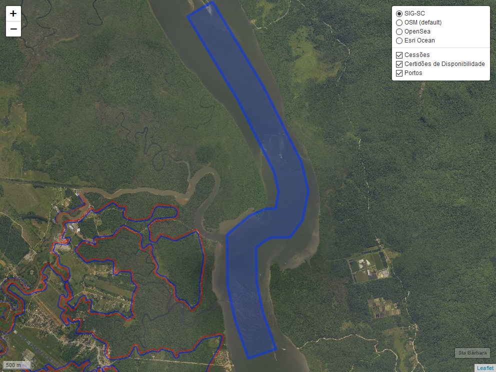

```{r setup, include=FALSE}
knitr::opts_chunk$set(echo = FALSE, fig.align = "center", out.width = "100%",
                      warning = FALSE, message = FALSE)
library(sf)
library(leaflet)
library(leafem)
```


```{r}
# 1. Digitação da Geometria
#  
# Digitar Coordenadas dos vértices
#
#                             E             N
coords <- matrix(data = c(740231.895, 7102091.398, #1
                          740713.725, 7102258.548, #2
                          740809.427, 7101982.676, #3
                          740327.596, 7101815.526, #4
                          740231.895, 7102091.398),#1
                 ncol = 2, byrow = TRUE)
#
# 2. Criação do polígono
#
#
pl <- st_sfc(st_polygon(list(coords)))
#
# 3. Criação dos metadados  
#
attr <- data.frame(interessado = "DSP Empreendimentos Imobiliários EIRELI",
                    nup = "04972.009273/2018-11",
                    protocolo = "SC03017/2018",
                    ref = 8385248,
                    concedida = TRUE,
                    area = st_area(pl),
                    municipio = 9985
                   )
#
# 4. Criação da feição
#
# Atentar para a definição do crs apropriado
#
# Exemplos:
#
# WGS 84 = 4326
# SAD 69 22S = 29192
# SIRGAS 2000 22S = 31982
#
spl_df <- st_sf(attr, geometry = pl, crs = 31982)
```


```{r}
# 5. Verificação
portos <- st_read("../portos.geojson")
cessoes <- st_read("../cessoes.geojson")
certdisp <- st_read("../certdisp.geojson")
```


```{r}
ext <- raster::extent(st_transform(spl_df, crs = 4326))
m <- spl_df %>%   
  st_transform(4326) %>%
  leaflet() %>%
  # Base Groups
  addTiles(group = "OSM (default)") %>%
  addProviderTiles(providers$OpenSeaMap, group = "OpenSea") %>%
  addProviderTiles(providers$Esri.OceanBasemap, group = "Esri Ocean") %>%
  addWMSTiles(baseUrl = "http://sigsc.sc.gov.br/sigserver/SIGSC/wms", 
            layers = list("OrtoRGB-Landsat-2012"),
            group = "SIG-SC") %>%
  addPolygons() %>%
  addPolygons(data = portos[4, ], color = "orange", fillColor = "orange", 
             group = "Portos") %>%
  addPolygons(data = certdisp, color = "red", fillColor = "red", 
              group = "Certidões de Disponibilidade", dashArray = "20 20") %>%
  addPolygons(data = cessoes, color = "red", fillColor = "red", 
              group = "Cessões") %>%
  # Layers control
  addLayersControl(
    baseGroups = c("OSM (default)", "OpenSea", "Esri Ocean"),
    overlayGroups = c("Cessões", "Certidões de Disponibilidade", "Portos"),
    options = layersControlOptions(collapsed = FALSE)
  ) %>%
  fitBounds(ext[1], ext[3], ext[2], ext[4]) %>%
  addHomeButton(ext = ext, layer.name = "DSP") %>%
  addMouseCoordinates()
# mapview::mapshot(m, file = "./map.png", remove_controls = NULL)
# 
m
```

```{r}
# 6. Escrita em disco
#
spl_df %>%
  st_transform(crs = 4326) %>%
  st_write("DSP.geojson", delete_dsn = TRUE)
```