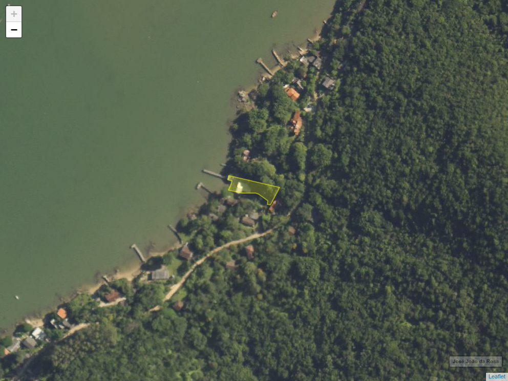

```{r setup, include=FALSE}
knitr::opts_chunk$set(echo = FALSE, fig.align = "center", out.width = "100%", 
                      warning = FALSE, message = FALSE)
library(sf)
library(leaflet)
library(raster)
library(leafem)
```

## Criar objeto

```{r}
#
# 1 Criação da poligonal do porto
#
# 1.1 Leitura da poligonal em KML
# Obs.: Da poliganal abaixo são extraídos pontos dos vértices. 
# É necessário confeccionar manualmente o polígono.
#  
io <- st_read("jose_joao_da_rosa.kml")
#
#
# 2. Criação dos atributos  
#
attr <- data.frame(
  interessado = "José João da Rosa",
  area = st_area(io),
  rip = "8185 0000028-35"
  )
spl_df <- st_sf(attr, geometry = st_geometry(st_zm(io)), crs = 4326)
# 4. Combinar polígonos
#
# spl_df <- rbind(io_1, io_2, io_3)
```
## Mapa

```{r}
# lpm_hom <- st_read("../linhas/LPM_HOMOLOGADA.geojson")
# lpm_dem <- st_read("../linhas/LPM_DEMARCADA.geojson")
# lpm_pre <- st_read("../linhas/LPM_PRESUMIDA.geojson")
# lltm_hom <- st_read("../linhas/LLTM_HOMOLOGADA.geojson")
# lltm_dem <- st_read("../linhas/LLTM_DEMARCADA.geojson")
# lltm_pre <- st_read("../linhas/LLTM_PRESUMIDA.geojson")
ext <- extent(spl_df)
m <- spl_df %>%
  leaflet() %>%
  #addTiles() %>%
  addWMSTiles(baseUrl = "http://sigsc.sc.gov.br/sigserver/SIGSC/wms", 
              layers = list("OrtoRGB-Landsat-2012")) %>%
# addProviderTiles(providers$Esri.WorldImagery) %>%
  addPolygons(stroke = TRUE, weight = 2, color = "yellow") %>%
  # addPolylines(data = lpm_hom, color = "blue") %>%
  # addPolylines(data = lpm_dem, dashArray = "20 20", color = "blue") %>%
  # addPolylines(data = lpm_pre, dashArray = "20 20", color = "blue", opacity = .1) %>%
  # addPolylines(data = lltm_hom, color = "red") %>%
  # addPolylines(data = lltm_dem, dashArray = "20 20", color = "red") %>%
  # addPolylines(data = lltm_pre, dashArray = "20 20", color = "red", opacity = .1) %>%
  addHomeButton(ext = ext, layer.name = "José João da Rosa") %>%
  fitBounds(lng1 = ext[1], lat1 = ext[3], lng2 = ext[2], lat2 = ext[4]) %>% 
  addMouseCoordinates() %>%
  addLogo("../SPU.jpg", src = "local", position = "bottomleft", 
                  offset.x = 15, offset.y = 15, 
                  width = 75, height = 75)
mapview::mapshot(m, file = "./8185-0000028-35.png", remove_controls = NULL, remove_url = FALSE)

```

## Metadados

```{r}
knitr::kable(t(st_drop_geometry(spl_df)))
```

## Exportar

```{r}
# 5. Escrever a nova entrada no BDE
#
#st_write(spl_df, "jose-joao-da-rosa.geojson", delete_dsn = TRUE)
```
